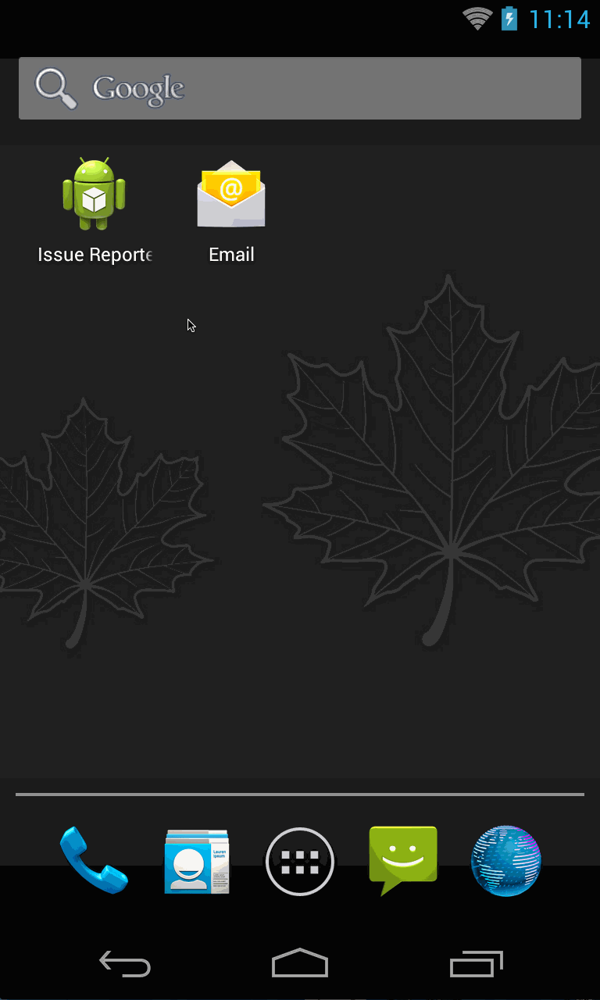

Issue Reporter
============

This library provide issue report feature to your app.

Click notification to report an issue that is include system informations and screenshot.



# Quick Start

```java
// MainActivity.java
@Override
protected void onCreate(Bundle savedInstanceState) {
    super.onCreate(savedInstanceState);
    setContentView(R.layout.activity_main);

    ReportMail reportMail = new ReportMail.Builder()
            .email("support@example.com")
            .subject("Report an issue")
            .body(new SystemProfile(this).toString())
            .build();
    IssueReporterFragment.apply(this, reportMail);
}
```

```xml
<!-- in AndroidManifest.xml -->
<application>
        <provider
                android:name="android.support.v4.content.FileProvider"
                android:authorities="${applicationId}.issuereporter.fileprovider"
                android:grantUriPermissions="true"
                android:exported="false">
            <meta-data
                    android:name="android.support.FILE_PROVIDER_PATHS"
                    android:resource="@xml/filepaths"/>
        </provider>
</application>
```
